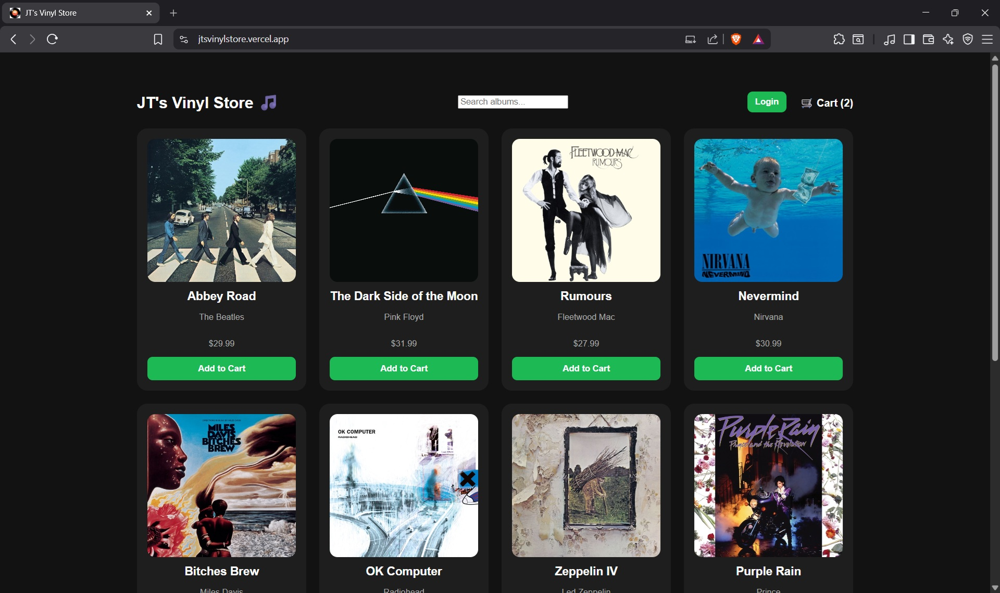
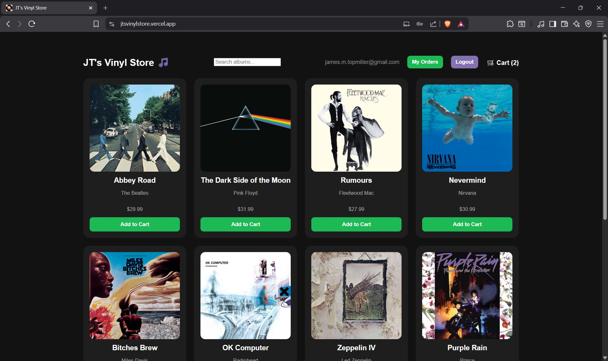
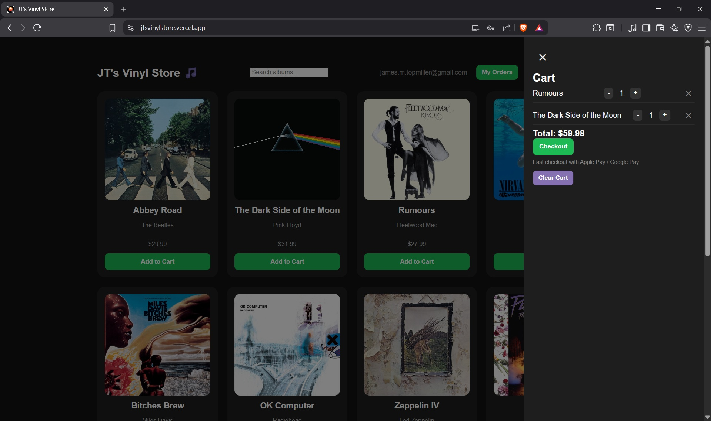
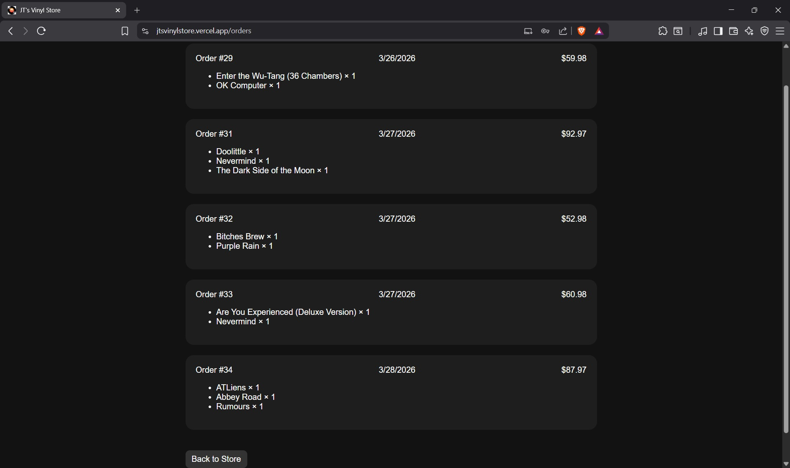
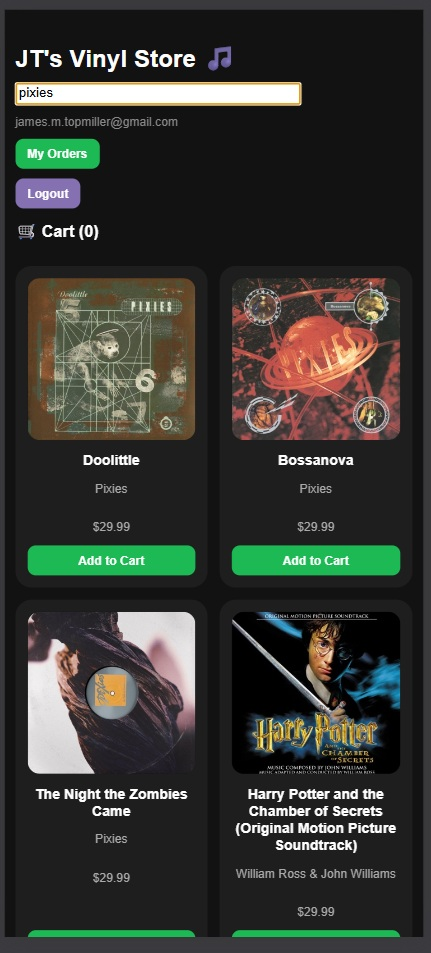
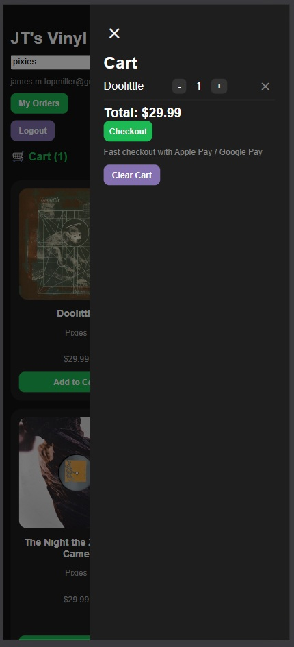

# 🛍️ Vinyl Store

A full-stack e-commerce web application for browsing and purchasing vinyl records, featuring authentication, cart functionality, and Stripe-powered checkout.

🌐 **Live Demo:** jtsvinylstore.vercel.app
🔗 **Frontend:** jtsvinylstore.vercel.app
🔗 **Backend API:** jts-vinyl-store.onrender.com

---

## ✨ Features

* 🛒 Add and remove items from cart
* 👤 User authentication (JWT-based)
* 💳 Secure checkout with Stripe
* 📦 Order tracking for logged-in users
* 🔍 Product search functionality
* 📱 Fully responsive design

---

## Screenshots








---

## 🛠️ Tech Stack

### Frontend

* React
* Context API (Cart + Auth)
* JavaScript
* CSS
* Vercel (hosting)

### Backend

* Node.js
* Express
* REST API
* better-sqlite3
* Stripe Webhooks
* Resend (transactional email)
* Render (hosting)

### Payments

* Stripe API

---

## 📁 Project Structure

```
vinyl-store/
├── client/        # React frontend
├── server/        # Express backend
├── README.md
```

---

## 🌐 Deployment

* **Frontend:** jtsvinylstore.vercel.app
* **Backend:** jts-vinyl-store.onrender.com (free tier)

⚠️ **Note:** The backend may take a few seconds to respond on first request due to cold start behavior on Render’s free tier.

---

## ⚙️ Environment Variables

### Server (`/server/.env`)

```
PORT=5000
STRIPE_SECRET_KEY=your_key
STRIPE_WEBHOOK_SECRET=your_webhook_secret
JWT_SECRET=your_secret
CLIENT_URL=http://jtsvinylstore.vercel.app
```

### Client (`/client/.env`)

```
REACT_APP_API_URL=https://jts-vinyl-store.onrender.com

```

---

## 🚀 Getting Started

### 1. Clone the repository

```
git clone https://github.com/YOUR_USERNAME/vinyl-store.git
cd vinyl-store
```

### 2. Install dependencies

```
cd client
npm install

cd ../server
npm install
```

### 3. Run locally

**Start backend:**

```
cd server
node server.js
```

**Start frontend:**

```
cd client
npm start
```

---
## Configure Stripe Webhook locally

stripe listen --forward-to localhost:5000/webhook

---

## 🔐 Security Notes

* Environment variables are used to protect sensitive data
* Stripe keys and JWT secrets are never committed to the repository
* Webhook signature verification is implemented for secure payment handling

---

## 🔮 Future Improvements

* Admin dashboard for managing products
* Inventory management
* Improved user order history UI
* Performance optimizations

---

## 👤 Author

James T
Aspiring Software Developer
